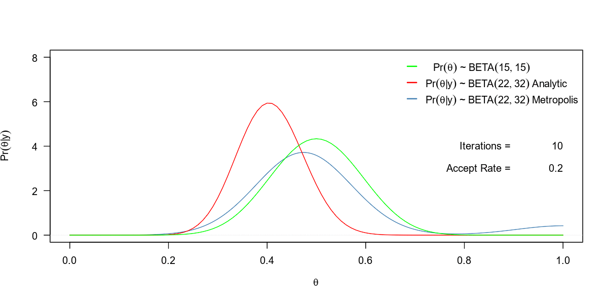
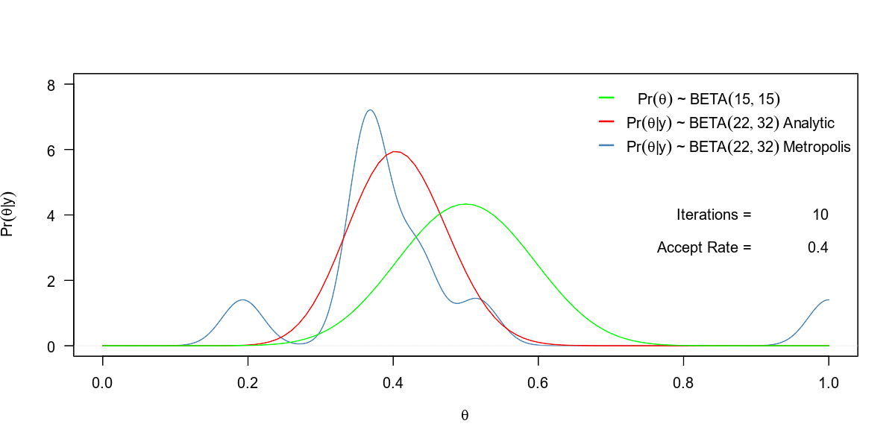

<style type='text/css'>
 img{margin: 20px 0;}
 figure{margin: 20px 0;}
 figcaption{font-weight: bold;}
 p.caption{font-weight: bold;}
</style>

```{r setup, include=FALSE}
knitr::opts_chunk$set(fig.align = 'center', fig.width = 10, 
                      message = F, warning = F,
                      cache = T, echo = T)
```

# Overview

This tutorial builds off of an example presented by <a target="" href='https://publichealth.ouhsc.edu/FacultyandStaff/FacultyandStaffContacts/BiostatisticsandEpidemiology/Anderson.aspx'>Michael P. Anderson</a>, Ph.D. during an Introduction to Bayesian Statistical Methods taught at Edwards AFB, CA.

<center></center>

Suppose that out of 24 air-to-air refueling attempts for an F-16 pilot, 7 attempts result in a premature disconnect. We wish to know if this pilot needs further training in air refueling by observing the ability to make a successful connection.  We treat each connection attempt as a Bernoulli trial wherein the data are a collection of binary values. Under this scenario the sampling distribution for the experiment is

$$
y|\theta\sim BINOM(n,\theta)\quad y\in \mathbb{Z^+},\theta \in [0,1].
$$

The data for this experiment are shown below

```{r, echo=T, results='hide'}
set.seed(42)
refuel <- double(24)
refuel[sample(1:24, size = 7)] <- 1
```

```{r, echo=FALSE}
status <- data.frame(refuel, row.names = paste0('Attempt ',1:24))
DT::datatable(status)
```

# Analytical Solution

Using this information, our likelihood $\Pr(y|\theta)$ is expressed as a function of the parameter $\theta$.

$$
\Pr(y|\theta) = \binom{24}{7}\theta^{7}(1-\theta)^{24-7}
$$

We have already seen that the beta distribution is conjugate with the binomial.  For this example we will compare the analytic results from beta-binomial distribution with those obtained from the Metropolis-Hastings algorithm.

Using the known conjugate relationship we can express Bayes Theorem as

$$
\Pr(\theta|y) = \frac{\Big[\binom{24}{7}\theta^{7}(1-\theta)^{24-7}\Big]\Big[\frac{\Gamma(\alpha+\beta)}{\Gamma(\alpha)\Gamma(\beta)}\theta^{\alpha-1}(1-\theta)^{\beta-1}\Big]}{\int_{\theta}\Big[\binom{24}{7}\theta^{7}(1-\theta)^{24-7}\Big]\Big[\frac{\Gamma(\alpha+\beta)}{\Gamma(\alpha)\Gamma(\beta)}\theta^{\alpha-1}(1-\theta)^{\beta-1}\Big] d\theta}
$$

Note that the denominator in the above expression is a constant value.  We can combine this term with the other constant terms as a value denoted by $C$ such that

$$
\begin{eqnarray}
\Pr(\theta|y) &=& &C&\bigg[\theta^{7}(1-\theta)^{24-7}\bigg]\bigg[\theta^{\alpha-1}(1-\theta)^{\beta-1}\bigg]\\\\
 &\propto& &&\bigg[\theta^{7}(1-\theta)^{24-7}\bigg]\bigg[\theta^{\alpha-1}(1-\theta)^{\beta-1}\bigg]\\\\
\end{eqnarray}
$$

Taking the product we see that

$$
\begin{aligned}
P(\theta|y)&\propto P(y|\theta)P(\theta)\\\\
&\propto \Big[\theta^{7}(1-\theta)^{24-7}\times\theta^{\alpha-1}(1-\theta)^{\beta-1}\Big]\\\\
&\propto \Big[\theta^{7+\alpha-1}(1-\theta)^{24-7+\beta-1}\Big]\\\\
&\propto \Big[\theta^{7+\alpha-1}(1-\theta)^{24-7+\beta-1}\Big]
\end{aligned}
$$

We observe that this the kernel of a $BETA(\alpha+7, \beta+24-7)$ distribution for which 
$$
\begin{aligned}
f(\theta|y)&=\frac{\Gamma(\alpha+ \beta+24)}{\Gamma(\alpha+7)\Gamma(\beta+24-7)}\theta^{\alpha+7-1}(1-\theta)^{\beta+24-7-1}\\\\
E[\theta|y] &= \frac{\alpha+7}{\alpha+\beta+24}\\\\
Var[\theta|y] &=\frac{(\alpha+7)(\beta+24-7)}{(\alpha+\beta+24)^2(\alpha+\beta+2\times24)}
\end{aligned}
$$

Now, suppose that we choose a $BETA(15,15)$ distribution a prior for $\theta$.  This information then gives

$$
\begin{aligned}
f(\theta|y)&=\frac{\Gamma(54)}{\Gamma(22)\Gamma(32)}\theta^{22-1}(1-\theta)^{32-1}\\\\
E[\theta|y] &= \frac{22}{54} = `r 22/54`\\\\
Var[\theta|y] &=\frac{(22)(32)}{(54)^2(78)} = `r (22*32)/(54^2*78)`
\end{aligned}
$$

<div class='fold s'>
```{r, fig.cap='Plot of prior and analytical posterior distributions for $\\theta$ from the F-16 refuel example'}
prior <- c(15,15)
y <- sum(refuel)      # 7
n <- length(refuel)   # 24

x <- seq(0,1,length = 1000)  #these are the theta values.

curve(dbeta(x,22,32),
      from = 0,
      to = 1,
      lwd = 2,
      col = "red",
      xlab = expression(theta),
      ylab = expression(Pr(theta*'|'*y)),
      las = 1)
curve(dbeta(x,15,15), 
      from = 0,
      to = 1,
      lwd = 2, 
      col = 'gray70',
      add = T)
legend(x = 1,
       y = 6,
       legend = c(expression(~~Pr(theta)*' ~ '*BETA(15,15)),
                  expression(Pr(theta*'|'*y)*' ~ '*BETA(22,32))),
       xjust = 1,
       bty = 'n',
       col = c('gray70','red'),
       lwd = 2,
       seg.len = 1)
```
</div>

# Building Our Own Metropolis Algorithm

Now that we have the analytic solution from which to compare, let's perform this analysis using the Metropolis algorithm.  The Metropolis algorithm is one of a class of models that fall under the term Markov chain monte carlo (MCMC).  markov chain monte carlo is based on the notion of a time-reversible markov chain.  For this type of Markov chain we are required to maintain what is known as the detailed balance, which is expressed as

$$
\pi(x)Q(y,x)\alpha(y,x) = \pi(y)Q(x,y)\alpha(x,y)
$$

where 

- $\pi(x)$ is a function that is proportional to the desired posterior distribution 
- $Q(y,x)$ is a probability density function that is centered at $x$ and returns the probability of observing $y$
- $\alpha(y,x)$ is the probability of accepting a transition from $x$ to $y$

To use any MCMC algorithm we must define a function $\pi(x)$ that is proportional to the desired posterior distribution.  A commonly used function is the unnormalized posterior constructed from the product of the likelihood and the prior distribution, that is

$$
\pi(x) = \Pr(Data|x)\times\Pr(x) \propto \Pr(x|Data).
$$

For this example, $\pi(x)$ is defined as the function shown in the code chunk below

```{r}
PI <- function(theta, alpha, beta, y, n) {
  
  theta ^ (alpha - 1 + y) * (1 - theta) ^ (n - y + beta - 1)
  
}
```

## Proposal Distribution $Q \sim BETA(a_0,b_0)$

To determine $Q(y,x)$ recall that the Metropolis algorithm is a special case of the Metropolis-Hastings algorithm in which the proposal distribution must be symmetric.  For this example we'll choose a symmetric $BETA(\alpha_p, \beta_p)$ distribution for which $\alpha_p = \beta_b$. With these components defined we rearrange the detailed balance equation as

$$
\frac{\alpha(y,x)}{\alpha(x,y)} = \frac{\pi(y)Q(x,y)}{\pi(x)Q(y,x)}.
$$

However, because our distribution $Q$ is symmetric, $Q(x,y) = Q(y,x)$ and the detailed balance equation reduces to 

$$
\frac{\alpha(y,x)}{\alpha(x,y)} = \frac{\pi(y)}{\pi(x)}.
$$

Thus, for each iteration our proposal distribution $Q(y,x)$ will be centered at some value $x$ in the parameter space and will then propose that we move to a new value $y$ in the parameter space.  We then evaluate $\pi(y)$ and the ratio $\pi(y)/\pi(x)$ if the ratio $\pi(y)/\pi(x) \ge 1$ we move from $x$ to $y$, if $\pi(y)/\pi(x) < 1$ we compare the ratio to a single draw from $U$ where $U \sim UNIF(0,1)$. If $\pi(y)/\pi(x) > U$ we move from $x$ to $y$, otherwise we stay at $x$.  Thus, at any point in the parameter space the acceptance propability is

$$
\frac{\alpha(y,x)}{\alpha(x,y)}=\min\bigg[1,\frac{\pi(y)}{\pi(x)}\bigg]
$$

The function defined in the code chunk below carries out the process described above where the proposal distribution is a symmetric Beta distribution

```{r}
metropolis <- function(iters, pi_func, ...){
  
   old <- double(iters)  # preallocate vector for posterior parameter values
   count <- 0            # initialize count of number of acceptance steps
   old[1] <- 1           # provide initial guess for parameter values
   
   for(i in 2:iters){
     
       propose <- rbeta(1, old[i-1], old[i-1])
       
       r <- pi_func(propose,...) / pi_func(old[i-1],...)
       
       if(runif(1,0,1) < r){
         
          old[i] <- propose    # If r > u accept proposal and move
          count  <- count + 1  # update count 
          
       } else {
         
          old[i] <- old[i-1]   # If r < u stay put
         
       }
   }
   
return(list(old = old,
            count = count,
            accept.rate = count/iters))
   
}
```

We then run the `metropolis` function for $100,000$ iterations and observe a fit of the density plot against the posterior that was computed analytically

```{r, cache=TRUE, fig.cap='Plot comparing prior and analytical posterior distributions for $\\theta$ with the posterior distribution of $\\theta$ found using a Metropolis algorithm where $Q \\sim BETA(a_0, b_0)$ from the F-16 refuel example'}
N = 100000
res <- metropolis(iters = N, 
                  pi_fun = PI, 
                  alpha = prior[1],
                  beta = prior[2], 
                  y = y,
                  n = n)

par(lwd = 2, cex = 0.8, lty = 1)

plot(density(res$old, from = 0, to = 1),
     col="steelblue",
     xlab = expression(theta),
     ylab = expression(Pr(theta*'|'*y)),
     las = 1,
     xlim = c(0,1),
     main = '')
curve(dbeta(x,22,32), col = "red",   add = T)
curve(dbeta(x,15,15), col = 'green', add = T)
legend('topright',
       legend = c(expression(~~~Pr(theta)*' ~ '*BETA(15,15)),
                  expression(Pr(theta*'|'*y)*' ~ '*BETA(22,32)~Analytic),
                  expression(Pr(theta*'|'*y)*' ~ '*BETA(22,32)~Metropolis)),
       xjust = 1,
       bty = 'n',
       lwd = 2,
       col = c('green','red','steelblue'),
       seg.len = 1)
text(x = c(1,0.9), y = c(4,4), 
     labels = c(N,'Iterations = '),
     adj = 1)
text(x = c(1,0.9), y = c(3,3), 
     labels = c(round(res$accept.rate, digits = 4),'Accept Rate = '),
     adj = 1)
```

We can then generate an animation using the third party utility Image Magick and the R package `magick` to show the convergence for this model as the number of iterations increases.  Note: this code will take around 15-20 minutes to run the code and stitch the 50 plots together into a `.gif` file that be saved to your local machine.

```{r, eval=FALSE}
iters <- c(seq(1e1,1e2,length.out = 10),
           seq(1e2,1e3,length.out = 10),
           seq(1e3,1e4,length.out = 10),
           seq(1e4,1e5,length.out = 10),
           seq(1e5,1e6,length.out = 10))

metout <- vector(mode = 'list', length = length(iters))


for(i in 1:length(iters)) {
  
    metout[[i]] <- metropolis(iters = iters[i], 
                              pi_fun = PI, 
                              alpha = prior[1],
                              beta = prior[2], 
                              y = y,
                              n = n)

}

library(magick)
img <- image_graph(1200, 600, res = 120)

for(j in 1:length(iters)){

    plot(density(metout[[j]]$old, from = 0, to = 1),
         col="steelblue",
         xlab = expression(theta),
         ylab = expression(Pr(theta*'|'*y)),
         las = 1,
         xlim = c(0,1),
         ylim = c(0,8),
         main = '')
    curve(dbeta(x,22,32), col = "red",   add = T)
    curve(dbeta(x,15,15), col = 'green', add = T)
    legend('topright',
           legend = c(expression(~~~Pr(theta)*' ~ '*BETA(15,15)),
                      expression(Pr(theta*'|'*y)*' ~ '*BETA(22,32)~Analytic),
                      expression(Pr(theta*'|'*y)*' ~ '*BETA(22,32)~Metropolis)),
           xjust = 1,
           bty = 'n',
           lwd = 2,
           col = c('green','red','steelblue'),
           seg.len = 1)
    text(x = c(1,0.9), y = c(4,4), 
         labels = c(iters[j],'Iterations = '),
         adj = 1)
    text(x = c(1,0.9), y = c(3,3), 
         labels = c(round(metout[[j]]$accept.rate, digits = 4),'Accept Rate = '),
         adj = 1)

}

dev.off()
animation <- image_animate(img, fps = 1)
print(animation)
```

<figure>
<center></center>
<figcaption>Simulation showing convergence of a Metropolis algorithm where $Q \sim BETA(a_0,b_0)$  to the analytical posterior distribution for $\theta$ from the F-16 refuel example</figcaption>
</figure>

## Proposal Distribution $Q \sim UNIF(0,1)$

As an alternative we could have also used a $UNIF(0,1)$ for our proposal distribution. The function `metropolis2`, defined in the code chunk below carries out this process 

```{r}
metropolis2 <- function(iters, pi_func, ...){
  
   old <- double(iters)  # preallocate vector for posterior parameter values
   count <- 0            # initialize count of number of acceptance steps
   old[1] <- 1           # provide initial guess for parameter values
   
   for(i in 2:iters){
     
       propose <- runif(1)
       
       r <- pi_func(propose,...) / pi_func(old[i-1],...)
       
       if(runif(1,0,1) < r){
         
          old[i] <- propose    # If r > u accept proposal and move
          count  <- count + 1  # update count 
          
       } else {
         
          old[i] <- old[i-1]   # If r < u stay put
         
       }
   }
   
return(list(old = old,
            count = count,
            accept.rate = count/iters))
   
}
```

Once again, we run the `metropolis2` function for $100,000$ iterations and observe a fit of the density plot against the posterior that was computed analytically

```{r,cache=TRUE, fig.cap='Plot comparing prior and analytical posterior distributions for $\\theta$ with the posterior distribution of $\\theta$ found using a Metropolis algorithm where $Q \\sim UNIF(0,1)$ from the F-16 refuel example'}
N = 100000
res2 <- metropolis2(iters = N, 
                    pi_fun = PI, 
                    alpha = prior[1],
                    beta = prior[2], 
                    y = y,
                    n = n)

par(lwd = 2, cex = 0.8)

plot(density(res2$old, from = 0, to = 1),
     col="steelblue",
     xlab = expression(theta),
     ylab = expression(Pr(theta*'|'*y)),
     las = 1,
     xlim = c(0,1),
     main = '')
curve(dbeta(x,22,32), col = "red",   add = T)
curve(dbeta(x,15,15), col = 'green', add = T)
legend('topright',
       legend = c(expression(~~~Pr(theta)*' ~ '*BETA(15,15)),
                  expression(Pr(theta*'|'*y)*' ~ '*BETA(22,32)~Analytic),
                  expression(Pr(theta*'|'*y)*' ~ '*BETA(22,32)~Metropolis)),
       xjust = 1,
       bty = 'n',
       col = c('green','red','steelblue'),
       lwd = 2,
       seg.len = 1)
text(x = c(1,0.9), y = c(4,4), 
     labels = c(N,'Iterations = '),
     adj = 1)
text(x = c(1,0.9), y = c(3,3), 
     labels = c(round(res2$accept.rate, digits = 4),'Accept Rate = '),
     adj = 1)
```

<figure>
<center></center>
<figcaption>Simulation showing convergence of a Metropolis algorithm where $Q \sim UNIF(0,1)$  to the analytical posterior distribution for $\theta$ from the F-16 refuel example</figcaption>
</figure>

# Modeling with JAGS

Just another Gibbs sampler (JAGS) is an open-source, command line utility used to simulate from Bayesian hierarchical models using Markov chain Monte Carlo (MCMC).  JAGS is compatible with WinBUGS/OpenBUGS as JAGS uses a similar language for defining a model.  Unlike BUGS, JAGS does not come with a GUI - it must to be interfaced using a separate utility or programning language. The big advantage of JAGS, compared to BUGS (WinBUGS/OpenBUGS) is platform independence - JAGS is written in C++, while BUGS is written in Component Pascal.

JAGS can be interfaced from R via the `rjags` or the `R2jags` packages.  In this tutorial we'll use the `R2jags` package along with some other helper packages shown below.

```{r, warning=FALSE, message=FALSE, cache=FALSE}
library(R2jags)      # Using R to Run 'JAGS'
library(coda)        # Output Analysis and Diagnostics for MCMC
library(mcmcplots)   # Create Plots from MCMC Output
```

The workhorse of the `R2jags` package is the function named `jags`. This function takes as input a model definition script containing data and starting values, uses this input script to automatically write a jags script, runs the JAGS model, and saves the simulations for easy access in R.  The default argument values for the `jags` function are shown below.  Note: A similar function exists in the `rjags` package called `jags.model`.  `R2jags::jags` is a wrapper for `rjags::jags.model` but also produces other useful results, thus we will proceed using `R2jags::jags`.

```{r, eval=FALSE}
R2jags::jags(data, 
             inits, 
             parameters.to.save, 
             model.file = "model.bug", 
             n.chains = 3, 
             n.iter = 2000, 
             n.burnin = floor(n.iter/2), 
             n.thin = max(1, floor((n.iter - n.burnin)/1000)), 
             DIC = TRUE, 
             working.directory = NULL, 
             jags.seed = 123, 
             refresh = n.iter/50, 
             progress.bar = "text", 
             digits = 5, 
             RNGname = c("Wichmann-Hill", 
                         "Marsaglia-Multicarry",
                         "Super-Duper", 
                         "Mersenne-Twister"), 
             jags.module = c("glm", "dic"))
```

Defining the JAGS model

```{r}
model <- 
"model
{
  ## likelihood
  	for(i in 1:24) 
			{
			refuel[i]~dbern(disconnect.prob)
			}
			
	## prior
		disconnect.prob ~ dbeta(alpha,beta)
		alpha <- 15
		beta <- 15
	}"
```

Next, we specify the parameter to be monitored and establish initial values to start the MCMC search. Note that the initial values need to be defined as a list of lists.  The reasong for having three initial values is because we will be running three separate chains.

```{r}
inits <- list(list("disconnect.prob" = 0.65),
              list("disconnect.prob" = 0.10),
              list("disconnect.prob" = 0.03))

jags.params <- c("disconnect.prob")
```

Now, we specify our observations of whether a disconnect occured during the observed refueling operations. 

```{r}
dat <- list(refuel = refuel)
```

Next we run the Markov-Chain Monte Carlo (MCMC) model and oberve the raw results. We then save the output as a mcmc-class object to make it easier to display the results.

```{r, cache=FALSE}
jagsfit <- jags(data = dat,
                inits = inits,
                param = jags.params,
                model.file = textConnection(model),
                n.chains = length(inits),
                n.iter = 100000,
                n.burnin = 1000,
                n.thin = 1)

jagsfit.mcmc <- coda::as.mcmc(jagsfit)
head(jagsfit.mcmc, n = 12)
```

Compare results against previous attempts and the analytic solution

```{r}
par(lwd = 2, cex = 0.8, lty = 1)

plot(density(jagsfit.mcmc[[1]][,2], from = 0, to = 1),
     col="purple",
     xlab = expression(theta),
     ylab = expression(Pr(theta*'|'*y)),
     las = 1,
     xlim = c(0.2,0.6),
     main = '',
     type = 'o', 
     cex = 0.5)
lines(density(res2$old, from = 0, to = 1),
     col="steelblue",
     las = 1,
     xlim = c(0,1))
lines(density(res$old, from = 0, to = 1),
     col="green",
     las = 1,
     xlim = c(0,1))
curve(dbeta(x,22,32), col = "red",   add = T)
legend('topright',
       legend = c(expression(Analytic~Posterior) ,
                  expression(Metropolis~Posterior~Q*' ~ '*BETA(a[0],b[0])),
                  expression(Metropolis~Posterior~Q*' ~ '*UNIF(0,1)),
                  expression(JAGS~Posterior)),
       xjust = 1,
       bty = 'n',
       lwd = 2,
       col = c('red','green','steelblue','purple'),
       seg.len = 1)
```

Compare plots of $E[\theta|y]$ against known analytically computed mean

```{r, fig.width=13}
par(mfrow = c(1,3))
plot(cumsum(jagsfit.mcmc[[1]][,2]) / 1:99000, 
     type = 'l', 
     col = 2,
     las = 1,
     xlab = 'Iteration',
     ylab = expression('E['*theta*'|'*y*']'))
abline(h = 22 / 54)
plot(cumsum(jagsfit.mcmc[[2]][,2]) / 1:99000, 
     type = 'l', 
     col = 3,
     las = 1,
     xlab = 'Iteration',
     ylab = expression('E['*theta*'|'*y*']'))
abline(h = 22 / 54)
plot(cumsum(jagsfit.mcmc[[3]][,2]) / 1:99000, 
     type = 'l', 
     col = 4,
     las = 1,
     xlab = 'Iteration',
     ylab = expression('E['*theta*'|'*y*']'))
abline(h = 22 / 54)
```

### Diagnostic plots

Plot the mcmc object to look for irregularities

```{r, cache=TRUE}
plot(jagsfit.mcmc[1:3])
```

```{r}
coda::raftery.diag(jagsfit.mcmc)
```

The `raftery.diag` function from the `coda` package performs the Raftery and Lewis's run length control diagnostic based on a criterion of accuracy of estimation of the quantile q.  This diagnostic computes the number of iterations required to estimate the quantile q to within an accuracy of +/- r with probability p.   The minimum length is the required sample size for a chain with no correlation between consecutive samples. Positive autocorrelation will increase the required sample size above this minimum value. 

The important value to check from the output of this function is the Dependence factor `I` which measures the ratio of the minimum number of samples to the actual number of samples.  Values of `I` larger than 5 indicate strong autocorrelation which may be due to a poor choice of starting value, high posterior correlations or ‘stickiness’ of the MCMC algorithm.

```{r, eval=FALSE}
mcmcplots::caterplot(jagsfit.mcmc)
R2jags::traceplot(jagsfit.mcmc)     

coda::geweke.diag(jagsfit.mcmc)
coda::gelman.diag(jagsfit.mcmc)
coda::gelman.plot(jagsfit.mcmc)
coda::heidel.diag(jagsfit.mcmc)
coda::autocorr.plot(jagsfit.mcmc)
coda::effectiveSize(jagsfit.mcmc)
```

### Update the model

```{r}
jagsfit <- update(jagsfit, 10000)
jagsfit
```

# Compare with STAN

```{r, cache=FALSE}
library(rstan)
library(parallel)
rstan_options(auto_write = TRUE)
options(mc.cores = parallel::detectCores())
```

Define the model and initial values

```{r}
modelcode <-'
data {  
  int<lower=0> J;
  int<lower=0,upper=1> x[J];
}
parameters {
  real<lower=0,upper=1> theta;
}
model {
  theta ~ beta(15,15);
  x ~ bernoulli(theta);
}'


inits <- list(list("theta" = 0.65),
              list("theta" = 0.10),
              list("theta" = 0.03))
```

```{r, cache=FALSE}
stan.mcmc = stan(model_code = modelcode,
                 data = list(J = length(refuel),x = refuel),
                 init = inits,
                 iter = 100000,
                 warmup = 1000,
                 thin = 1,
                 chains = 3)
```

extract simulated posterior observations from stan model 

```{r}
model_sim = extract(stan.mcmc)
```

Compare plot of STAN to JAGS

```{r}
par(lwd = 2, cex = 0.8, lty = 1)

plot(density(jagsfit.mcmc[[1]][,2], from = 0, to = 1),
     col="purple",
     xlab = expression(theta),
     ylab = expression(Pr(theta*'|'*y)),
     las = 1,
     xlim = c(0.2,0.6),
     main = '',
     type = 'o',
     pch = 16,
     cex = 0.5)
lines(density(model_sim[[1]][1:99000], from = 0, to = 1),
     col="orange")
curve(dbeta(x,22,32), add = T)
legend('topright',
       legend = c(expression(Analytic~Posterior),
                  expression(JAGS~Posterior),
                  expression(STAN~Posterior)),
       xjust = 1,
       bty = 'n',
       lwd = 2,
       col = c('black','purple','orange'),
       seg.len = 1)
```
