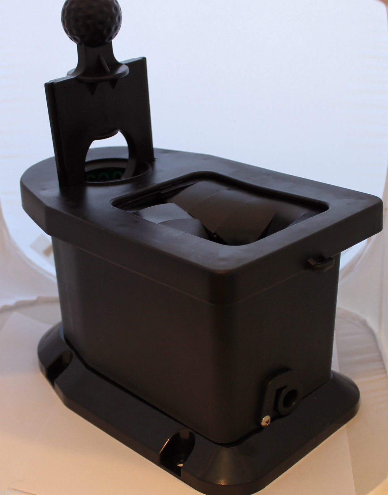

```{r setup, include=FALSE}
knitr::opts_chunk$set(echo = TRUE)
```

<style>
figure{text-align: center; padding: 20px 0;}
figcaption{font-weight: bold; padding-top: 10px;}
</style>

## An Introductory Example

Alice has two coins in her pocket, a fair coin (heads on one side and tails on the other side) and a two-headed coin (heads on both sides). She picks a coin at random from her pocket, tosses it and obtains heads. What is the probability that she flipped the fair coin?

****

This is an application of Bayes Theorem (aka Bayes Rule) which is expressed -- for some partition of the sample space $\{B_j\}, j \in \mathbb{R}^+$ -- as

$$
\begin{aligned}
\Pr(B_i|A)&=\frac{\Pr(A|B_i)\Pr(B_i)}{\Pr(A)}\\\\
&=\frac{\Pr(A|B_i)\Pr(B_i)}{\underset{j}{\sum} \Pr(A|B_j)\Pr(B_j)}
\end{aligned}
$$

>Where

>+ $\Pr(B_i|A)$ is known as the posterior probability of the event $B_i$ given event $A$ 

>+ $\Pr(A|B_i)$ is known as the prior probability (or likelihood) of event $A$ given event $B_i$

>+ $\Pr(B_i)$ is the marginal probability of event $B_i$

>+ $\sum_{j} \Pr(A|B_j)\Pr(B_j)$ is the Total Probability of Event $A$ summed over every event in $\{B_j\}, j \in \mathbb{R}^+$

****

Returning to the question about Alice and her coin flip, we can determine $\Pr(\text{Heads}|\text{Fair Coin})$ by restating Bayes Rule as

$$
\begin{aligned}
\Pr(\text{Fair Coin}|\text{Heads})&=\frac{\Pr(\text{Heads}|\text{Fair Coin})\Pr(\text{Fair Coin})}{\Pr(\text{Heads})}\\\\
&=\frac{\Pr(\text{Heads}|\text{Fair Coin})\Pr(\text{Fair Coin})}{\Pr(\text{Heads}|\text{Fair Coin})\Pr(\text{Fair Coin})+\Pr(\text{Heads}|\text{Unfair Coin})\Pr(\text{Unfair Coin})}\\\\
&=\frac{(0.50)(0.50)}{(0.50)(0.50)+(1)(0.50)}\\\\
&=\frac{0.25}{0.75}\\\\
&=0.333333
\end{aligned}
$$

This result tells us that if Alice flips a coin and the coin lands on head there's only a $1/3$ chance that she flipped the fair coin.

## A Better Example

A push-rod eye is a plastic casted part used in some golf-ball washers found on most golf courses

<figure>

<figcaption>An example push-rod eye</figcaption>
</figure>

A producer of push-rod eyes wants to know the probability that their manufacturing process produces defective parts.  More specifically, we wish to

1. Estimate the the probability of observing $y$ defective units out of $n$ inspected units.  
2. Predict the probability that a future unit from the the manufacturing process will be defective

Under this scenario, we inspect each item to determine whether it is defective or not.  Thus, our data will be a collection of binary values and the sampling distribution will be

$$
y|\theta\sim BINOM(n,\theta)\quad y\in \mathbb{Z^+},\theta \in [0,1]
$$

The producer tells us that $2430$ push-rod eyes have been inspected to date and $219$ were found to be defective.  Using this information, our likelihood $\Pr(y|\theta)$ is expressed as a function of the parameter $\theta$.

$$
\Pr(y|\theta) = \binom{2430}{219}\theta^{219}(1-\theta)^{2430-219}
$$

From a frequentist perspective, we approach this analysis assuming that we know nothing about the true value of $\theta$ before observing data and therefore give equal credibility to all possible values in $[0,1]$.  From a Bayesian perspective, we approach this analysis by seeking to elicit prior information from experts who may be able to help focus our analysis by suggesting which values of $\theta$ may be more credible than others.  In this example a push-rod eye 'expert' has stated a strong belief that $\theta\in(0.05,0.15)$.  We interpret this expert opinion as meaning $\Pr(\theta\in(0.05,0.15)=0.95$ and therefore $\Pr(\theta<0.05)=\Pr(\theta>0.15)=0.025$.  With this information, our goal is to choose a distribution with a support that matches the possible value of $\theta$ and conforms to the our experts opinion. A possible prior distribution for $\theta$ is a Beta distribution, where the values of shape parameters $\theta$ and $\beta$ are chosen to reflect our uncertainty about $\theta$ as reflected by $\Pr(\theta<0.05)=\Pr(\theta>0.15)=0.025$. 

<figure>

<figcaption>A world-renowned push-rod eye expert</figcaption>
</figure>

The `LearnBayes` package includes the `beta.select()` function that can return the beta distribution shape parameters corresponding to information about two quantiles.  Using the information provided by our 'expert' results in the following parameter values.

```{r}
library(LearnBayes)

quantile1 <- list(p = 0.025, x = 0.05)
quantile2 <- list(p = 0.975, x = 0.15)

(shapes <- beta.select(quantile1 = quantile1,
                       quantile2 = quantile2))
```

Observing a plot of the beta distribution pdf with these parameters shows that it appears represent the uncertainty about $\theta$ as expressed by our expert.

```{r}
curve(dbeta(x, shapes[1], shapes[2]), 
      n = 500,
      lwd = 2,
      lty = 1,
      las = 1,
      ylab = expression(f(theta)),
      xlab = expression(theta))

abline(v = c(0.05, 0.15), 
       lty = 2,
       col = 'steelblue')

mtext(side = 3,
      text = c(0.05, 0.15),
      at = c(0.05, 0.15),
      col = 'steelblue',
      cex = 1.05, 
      font = 2)

legend('topright',
       legend = c(expression(f(theta)[prior])),
       lty = c(1),
       col = 1,
       bty = 'n',
       seg.len = 2,
       lwd = 2)
```

We now have sufficient information to express Bayes Theorem as

$$
\Pr(\theta|y) = \frac{\Big[\binom{2430}{219}\theta^{219}(1-\theta)^{2430-219}\Big]\Big[\frac{\Gamma(12.08+116.55)}{\Gamma(12.08)\Gamma(116.55)}\theta^{12.08-1}(1-\theta)^{116.55-1}\Big]}{\int_{\theta}\Big[\binom{2430}{219}\theta^{219}(1-\theta)^{2430-219}\Big]\Big[\frac{\Gamma(12.08+116.55)}{\Gamma(12.08)\Gamma(116.55)}\theta^{12.08-1}(1-\theta)^{116.55-1}\Big] d\theta}
$$

Note that the denominator in the above expression is a constant value.  We can combine this term with the other constant terms as a value denoted by $C$ such that

$$
\begin{eqnarray}
\Pr(\theta|y) &=& &C&\bigg[\theta^{219}(1-\theta)^{2430-219}\bigg]\bigg[\theta^{12.08-1}(1-\theta)^{116.55-1}\bigg]\\\\
 &\propto& &&\bigg[\theta^{219}(1-\theta)^{2430-219}\bigg]\bigg[\theta^{12.08-1}(1-\theta)^{116.55-1}\bigg].\\\\
\end{eqnarray}
$$

Taking the product we see that

$$
\begin{aligned}
P(\theta|y)&\propto P(y|\theta)P(\theta)\\\\
&\propto \Big[\theta^{219}(1-\theta)^{2430-219}\times\theta^{12.08-1}(1-\theta)^{116.55-1}\Big]\\\\
&\propto \Big[\theta^{219+12.08-1}(1-\theta)^{2430-219+116.55-1}\Big]\\\\
&\propto \Big[\theta^{231.08-1}(1-\theta)^{2327.55-1}\Big]
\end{aligned}
$$

which we recognize as the kernel of a beta distribution.  This suggests that the posterior distribution of $\theta$ (i.e. the distribution after merging our observed data with our expert opinion) is $BETA(231.08,2327.55)$. Adding a plot of the posterior pdf to the previous plot of the prior pdf reveals how the data has shifted our belief and reallocated our credibility to a narrow region the $\theta$ sample space.

```{r}
curve(dbeta(x, shapes[1], shapes[2]), 
      n = 500,
      lwd = 2,
      lty = 1,
      las = 1,
      ylim = c(0,28),
      ylab = expression(f(theta)),
      xlab = expression(theta))

curve(dbeta(x, 219 + shapes[1],2430 - 219 + shapes[2]),
      n = 500, 
      lwd = 2,
      col = 2,
      add = T)

abline(v = c(0.05, 0.15), 
       lty = 2,
       col = 'steelblue')

mtext(side = 3,
      text = c(0.05, 0.15),
      at = c(0.05, 0.15),
      col = 'steelblue',
      cex = 1.05, 
      font = 2)

legend('topright',
       legend = c(expression(f(theta)[prior]),
                  expression(f(theta)[posterior])),
       col = 1:2,
       bty = 'n',
       seg.len = 2,
       lwd = 2)
```

Further, we can compute a $95\%$ credible interval for $\theta$ from the posterior distribution

```{r}
qbeta(c(0.025, 0.975),231.08,2327.55)
```

and generate a plot of $\Pr(y|\theta)$ for values of $\theta$ in the posterior distribution 

```{r}
theta <- qbeta(seq(0.025, 0.975, 0.005),231.08,2327.55)

plot(x = theta,
     y = dbinom(219, 2430, theta))
```

## Posterior Predictive distribution

The posterior predictive distribution is the distribution for a future predicted observation $y^*$ based on the data that has already been observed. So the posterior predictive distribution is basically used to predict new data values.  The posterior predictive distribution does not depend on the unknown parameter $\theta$ because it has been integrated out, i.e., for this problem the posterior predictive distribution is expressed as

$$
\begin{aligned}
p(y^*,n^*|y)&=\int_\Theta c\times p(y^*,n^*,\theta|y)d\theta=\int_\Theta c\times p(y^*,n^*|\theta)p(\theta|y)d\theta\\\\
&= \int_\Theta\bigg[\binom{n^*}{y^*}\theta^{y^*}(1-\theta)^{n^*-y^*}\bigg]\bigg[\frac{\Gamma(231.01+2327.55)}{\Gamma(2327.55)\Gamma(231.01)} \theta^{231.08-1}(1-\theta)^{2327.55-1}\bigg]d\theta\\\\
&=\binom{n^*}{y^*}\frac{\Gamma(231.01+2327.55)}{\Gamma(2327.55)\Gamma(231.01)}\int_\Theta\theta^{y^*+231.08-1}(1-\theta)^{(n^*-y^*)+2327.55-1}d\theta\\\\
&=\binom{n^*}{y^*}\frac{\Gamma(231.01+2327.55)}{\Gamma(2327.55)\Gamma(231.01)}\frac{\Gamma(2327.55+n^*-y^*)\Gamma(231.01+y^*)}{\Gamma(231.01+2327.55 + n^*)}
\end{aligned}
$$

The code in the chunk below creates a function to compute values from this posterior predictive distribution.  Note the use of the loggamma function `lgamma(x)` in the code chunk below since `gamma(x)` can be numerically unstable for large values of `x`.

```{r}
pred_pushrod <- function(n,y){
  
  if(n > y) stop('y cannot be greater than n')
  
  term1 <-  lgamma(231.08 + 2327.55) - (lgamma(231.08) + lgamma(2327.55)) 
  term2 <- (lgamma(y + 231.08) + lgamma(n - y + 2327.55)) - lgamma(231.08 + 2327.55 + n)
  term3 <-  log(choose(n,y))
  
  return(exp(term1 + term2 + term3))
  
}
```
